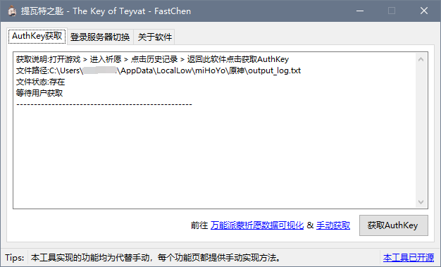
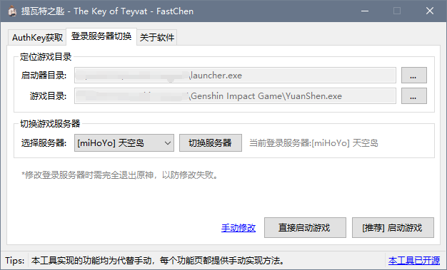

  
  <h3>提瓦特之匙 - The Key of Teyvat</h3>
  
<a href="https://ys.nullcraft.org/" target="_blank">万能派蒙</a>的配合工具

  
  
  
  

## 最新版提瓦特之匙 已支持原神2.1版本切换 需要前往交流群下载。

## # 为什么制作这款本地工具？

这款工具最初仅用于获取Authkey来对接[万能派蒙-祈愿查询](https://ys.nullcraft.org/gacha)(在线版祈愿数据查看)的，但是后续因为有朋友玩官服和B服两个账户，需要下载两个客户端所以就又添加了一个一客户端切换登录服务器的功能，通过结合游戏1.1版本的修改方法再加上自行测试，目前发现了一种通杀方法(修改两个config)的数据。所以这款工具就出现了，而且开源在这里。

## # 下载，仅在下面提供地址发布

- [提瓦特厨神交流群群文件:711723320](https://jq.qq.com/?_wv=1027&k=uZdeXKvr)
- ~~Github Releases~~ 后续仅在交流群提供更新。

## # 一些图片

## # 更新计划

- [x] 登录服务器游戏路径保存本地
- [ ] 优化代码
- [ ] 优化界面
- [ ] 添加更多的注释

## # Q&A
**Q:本地工具为什么叫提瓦特之匙?** 
A:由所罗门之匙改编而来

**Q:这款工具会导致封号吗？** 
A:工具没有对游戏本身做修改，仅是对登录入口进行了切换，(游戏是读取配置文件来选择登录入口的)，miHoYo官方也从未正式说明切换服务器是否会导致封号问题，所以不管是使用工具切换，还是手动切换，结果是一样的。

## 一起联机，一起锄大地！
[提瓦特厨神交流群:711723320](https://jq.qq.com/?_wv=1027&k=uZdeXKvr)

## # 捐助支持

[捐助我们](https://docs.nullcraft.org/donate) | [爱发电](https://afdian.net/@fastchen)
